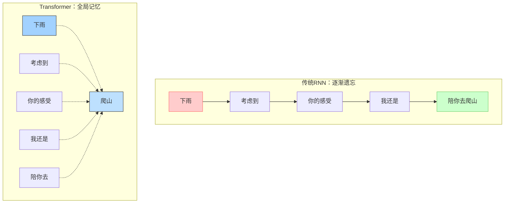

---
{"publish":true,"title":"Transformer vs Seq2Seq - 从\"排队点餐\"到\"自助餐\"的进化\"","created":"2025-07-13T23:23:24.509+08:00","modified":"2025-07-13T23:26:51.227+08:00","tags":["Seq2Seq","Transformer","并行处理","长距离依赖","原子概念"],"cssclasses":""}
---


## 🎯 核心概念（一句话总结）
**Transformer通过"全员同时工作"替代"排队依次处理"，解决了传统Seq2Seq的三大瓶颈：速度、记忆、顺序理解。**

## 📊 对比表：传统Seq2Seq vs Transformer

| 维度 | 传统Seq2Seq (RNN) | Transformer | 生活比喻 |
|---|---|---|---|
| **处理方式** | 串行处理 | 并行处理 | 排队点餐 vs 自助餐 |
| **记忆范围** | 短期记忆(最近几个词) | 全局记忆(整句话) | 金鱼记忆 vs 大象记忆 |
| **训练速度** | 慢(顺序依赖) | 快(并行计算) | 单线程 vs 多线程 |
| **长句理解** | 容易遗忘开头 | 整句同时理解 | 读完忘记开头 vs 一眼看全句 |

## 🎯 三大改进机制（原子级拆解）

### 🔄 改进1：并行处理 —— "微信群vs传纸条"

**传统Seq2Seq的问题**：
```
句子："我喜欢吃北京烤鸭"
处理顺序：我 → 喜欢 → 吃 → 北京烤鸭（必须等前一个处理完）
```

**Transformer的解决方案**：
```
所有词同时处理：「我」「喜欢」「吃」「北京烤鸭」→ 同时理解！
```

**技术原理**：
- **自注意力机制**：每个词直接"看见"所有其他词
- **数学优势**：矩阵运算可并行，GPU加速显著

**生活比喻**：
- 传统：10个人排队体检，每人5分钟，总耗时50分钟
- Transformer：10个人同时体检，总耗时5分钟

### 🔍 改进2：长距离依赖 —— "金鱼记忆vs大象记忆"

**传统RNN的困境**：
```
长句："虽然今天下雨，但是考虑到你的感受，我还是决定陪你去爬山"
RNN处理到"爬山"时，已经忘记"下雨"这个重要信息
```

**Transformer的突破**：
```
注意力权重：
爬山 ←→ 下雨：权重 0.8（强关联）
爬山 ←→ 感受：权重 0.7（中等关联）
```

**可视化理解**：


### 📍 改进3：位置编码 —— "给每个词发身份证"

**问题背景**：
如果所有词同时处理，如何知道"北京烤鸭"是一个整体还是分开的词？

**解决方案**：
```
每个词的"身份证"：
北京：位置1 + 语义向量
烤鸭：位置2 + 语义向量
```

**技术细节**：
- **正弦位置编码**：用数学函数编码位置信息
- **相对位置**：不仅知道绝对位置，还知道相对距离

## 🎯 实战应用：翻译任务对比

### 📝 案例：中英文翻译

**输入**："我今天很高兴认识你"

**传统Seq2Seq过程**：
1. 逐词理解：我→今天→很高兴→认识你
2. 容易丢失："今天"和"很高兴"的情感关联
3. 输出："I am happy to meet you today"（可能丢失"很高兴"的强调）

**Transformer过程**：
1. 同时理解所有词的关系
2. 注意力权重："很高兴"→"认识你" = 0.9（情感强度）
3. 输出："I am truly delighted to meet you today"（准确传达情感强度）

## 🔗 知识网络连接

### 🔍 前置原子概念（需要掌握）
- [[🪄AI漫谈/注意力机制在 Transformer 模型中是如何运作的？]] —— 理解并行处理的核心机制
- [[🪄AI漫谈/什么是位置编码（Positional Encodings），为什么要使用它们？]] —— 理解顺序保持原理
- [[🪄AI漫谈/Transformer 如何解决梯度消失（Vanishing Gradient）问题？]] —— 理解为什么能训练更深网络

### 🎯 延伸原子概念（接下来学习）
- [[🪄AI漫谈/什么是多头注意力（Multi-Head Attention），它如何增强 LLM？]] —— 理解并行处理的增强版
- [[🪄AI漫谈/Transformer 中的注意力分数是如何计算的？]] —— 理解具体计算细节
- [[🪄AI漫谈/在 LLM 训练中，自回归模型（Autoregressive Models）和掩码模型（Masked Models）有何不同？]] —— 理解训练策略差异

## 💡 一句话记忆法

**"Seq2Seq像排队点餐，Transformer像自助餐——所有人同时取餐，但每人都能拿到自己需要的搭配。"**

## 🎯 30秒速记卡片

```
🎴 原子概念：Transformer改进Seq2Seq
├─ 并行处理：微信群 > 传纸条
├─ 长距离记忆：大象 > 金鱼  
└─ 位置编码：给每个词发身份证
```

## 🧪 验证理解（3个小测试）

1. **选择题**：为什么Transformer训练更快？
   A) 算法更复杂  B) 并行计算  C) 数据更多  ✅**B**

2. **判断题**：RNN无法处理长句子，因为会忘记开头信息 ✅**正确**

3. **应用题**：用生活例子解释"长距离依赖"
   ✅**答案示例**：就像你能记住一周前朋友说的重要承诺，而金鱼3秒就忘

## 🔍 深度思考

> **本质洞察**：Transformer不是"改进"了Seq2Seq，而是**重新定义了序列处理范式**——从"时间维度"转向了"空间维度"的并行理解。

---

*返回知识原子库：[[🪄AI漫谈/index\|AI概念地图]]*