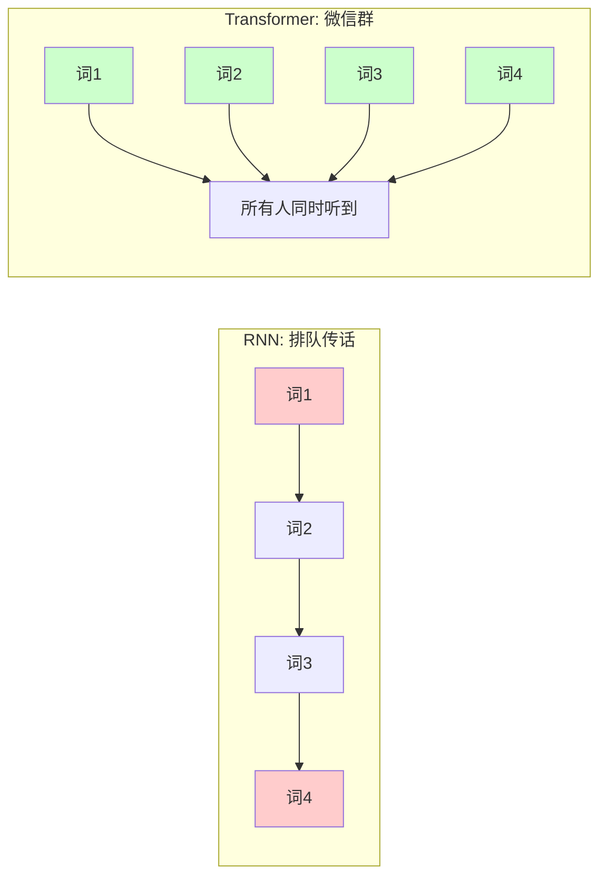
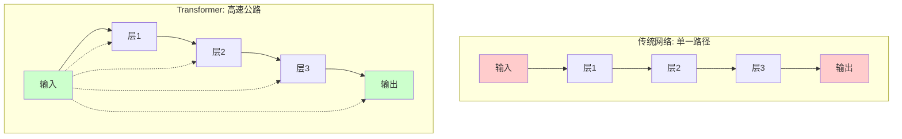

---
{"publish":true,"title":"Transformer 如何解决梯度消失问题？——从\"传话游戏\"到\"高速公路\"的进化","created":"2025-07-13T23:06:47.074+08:00","modified":"2025-07-13T23:17:14.098+08:00","tags":["Transformer","梯度消失","深度学习","残差连接"],"cssclasses":""}
---


## 🎯 从一个失败的故事开始

想象一下，你正在玩一个"传话游戏"：

> 第一个人对第二个人小声说："我今天早上吃了豆浆油条"
> 第二个人传给第三个人："我早上吃了油条"
> 第三个人传给第四个人："早上吃油条"
> 最后一個人听到的是："吃"

这就是传统 **RNN** 在处理长序列时遇到的 **梯度消失** 问题 —— 信息在层层传递中逐渐丢失，最终什么都剩不下。

## 🤔 什么是梯度消失？用生活场景理解

### 场景一：深井喊话
想象你站在一口**深井**底部向上喊话，声音每经过一层井壁就被吸收一部分，传到井口时已经微弱得几乎听不见。

在神经网络中，梯度就像这个声音，每经过一层网络就被"削弱"一点，最终前几层的权重几乎得不到更新 —— 这就是 **梯度消失**。

### 场景二：公司信息传递
一个10层管理的公司：
- CEO的指令传到基层员工时，已经变形成"今天不加班" → "今天要加班" 
- 基层员工的反馈传到CEO时，已经变成"一切正常"（实际上问题很大）

这就是 **梯度消失导致的学习困难** —— 网络深层的错误信号传不到浅层，浅层永远不知道自己做得对不对。

## 🚀 Transformer 的"三条高速公路"解决方案

### 第一条：自注意力机制 —— "全员同时通话"

传统 RNN 像**排队打电话**，必须等前一个人说完，下一个人才能听。

**Transformer** 像**微信群语音**，所有人**同时说话**，每个人都能直接听到所有人的声音，不需要层层传递！



**为什么这能解决梯度消失？**
- 没有长距离依赖，每个词都能**直接"看见"** 所有其他词
- 梯度不需要穿越层层网络，可以**直达目标**

### 第二条：残差连接 ——"记忆高速公路"

想象你在修建一条**山路**：
- 传统网络：必须从山脚一步步爬到山顶，走错一步就迷路
- 残差连接：**修了高速公路**，可以直接从山脚飙车到山顶，还能随时回到起点



**技术解释**：
```
传统：output = layer(input)
残差：output = input + layer(input)  # 总有"记忆备份"
```

### 第三条：层归一化 ——"交通调度员"

没有红绿灯的城市会怎样？**交通瘫痪！**

在神经网络中，层归一化就是那个**智能交通调度员**：
- 确保每层的输入数据**分布稳定**
- 防止某些"道路"（神经元）过于拥堵
- 让梯度能够**顺畅流动**而不"堵车"

## 🎭 一个完整的比喻故事

### 传统 RNN：古代的驿站传书
> 唐朝的驿站系统，从长安到边疆需要经过100个驿站。每个驿卒都要重新抄写一遍信件，最后边疆收到的信已经和原文大不相同。

### Transformer：现代的信息高速公路
> 现在的微信群，长安的朋友@边疆的朋友，消息**瞬间直达**，中间没有任何信息损失！

## 🔗 知识连接地图

### 🔍 前置知识（你需要先了解）
- [[🪄AI漫谈/注意力机制在 Transformer 模型中是如何运作的？]] - 理解注意力如何工作
- [[🪄AI漫谈/Transformer 如何改进传统的 Seq2Seq 模型？]] - 理解并行化的优势
- [[🪄AI漫谈/链式法则（Chain Rule）如何应用于 LLM 的梯度下降？]] - 理解梯度计算原理

### 🎯 深度探索（接下来可以学）
- [[🪄AI漫谈/什么是位置编码（Positional Encodings），为什么要使用它们？]] - Transformer如何处理顺序信息
- [[🪄AI漫谈/雅可比矩阵（Jacobian Matrix）在 Transformer 的反向传播中扮演什么角色？]] - 数学层面的深入理解
- [[🪄AI漫谈/在 LLM 中，嵌入的梯度（Gradients）是如何计算的？]] - 具体计算细节

## 💡 一句话总结

**Transformer** 通过 **"全员同时通话"**（自注意力）+ **"记忆高速公路"**（残差连接）+ **"智能交通调度"**（层归一化）这三板斧，彻底解决了困扰深度学习多年的梯度消失问题，让**信息高速公路**畅通无阻！

>[!tip]+ 思考时刻
> 其实生活中处处都是"梯度消失"的影子：
> - 为什么高层决策传不到基层？
> - 为什么用户反馈到达不了产品团队？
> - Transformer的解决方案能否启发我们设计更好的组织沟通机制？

---
*回到知识花园：[[🪄AI漫谈/index\|AI知识地图]]*