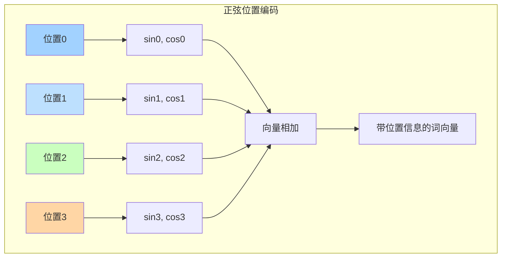
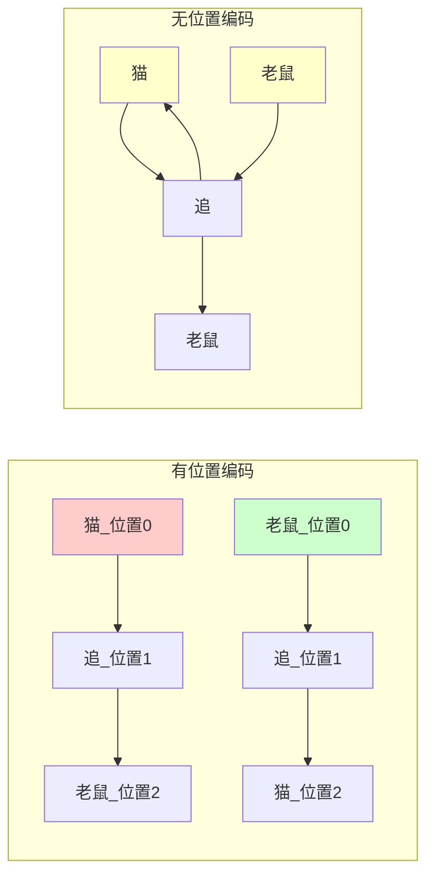

---
{"publish":true,"title":"Positional Encodings","created":"2025-07-13T23:32:58.084+08:00","modified":"2025-07-13T23:36:26.676+08:00","tags":["位置编码","Transformer","序列顺序","原子概念","正弦函数"],"cssclasses":""}
---


## 🎯 核心概念（一句话总结）
**位置编码是给Transformer中每个词发的"身份证"，让模型知道"我爱你"和"你爱我"不是同一个意思。**

## 🤔 问题背景：Transformer的"失忆症"

### 🎭 生活场景：语序的重要性
想象一下这个对话：
- **正确**："我昨天吃了北京烤鸭" ✅
- **错误**："烤鸭北京吃了昨天我" ❌

**问题**：Transformer的自注意力机制会同时"看见"所有词，如果不告诉它顺序，它会认为这两个句子意思一样！

### 🔍 技术困境
```
Transformer的自注意力：
所有词同时处理 → 失去时间顺序 → "我爱你" = "你爱我"
```

## 🎯 位置编码的"身份证系统"

### 🆔 身份证设计原理
每个词获得一个独特的"身份证号码"：

```
句子："我爱北京烤鸭"
身份证分配：
- 我：位置0 + 身份信息 [sin(0), cos(0), sin(0/10000), cos(0/10000), ...]
- 爱：位置1 + 身份信息 [sin(1), cos(1), sin(1/10000), cos(1/10000), ...]
- 北京：位置2 + 身份信息 [sin(2), cos(2), sin(2/10000), cos(2/10000), ...]
- 烤鸭：位置3 + 身份信息 [sin(3), cos(3), sin(3/10000), cos(3/10000), ...]
```

### 🌊 正弦函数的魔法

**为什么选择正弦波？**
- **周期性**：像波浪一样，既能区分位置又能保持连续性
- **相对距离**：能计算任意两个词之间的距离
- **维度丰富**：每个位置有多个"特征维度"



## 🎯 三种实现方式对比

| 方法 | 原理 | 优点 | 缺点 | 适用场景 |
|---|---|---|---|---|
| **正弦编码** | 数学函数计算 | 无需训练，泛化好 | 固定模式 | 通用模型 |
| **学习编码** | 神经网络学习 | 适应特定任务 | 需要训练数据 | 特定领域 |
| **相对位置** | 计算相对距离 | 更好泛化 | 计算复杂 | 长文本 |

## 🎯 实战验证：语序敏感性测试

### 🧪 实验设计
```
测试句子1："猫追老鼠"
测试句子2："老鼠追猫"

预期结果：
- 有位置编码：两个句子意义不同
- 无位置编码：两个句子意义相同（错误！）
```

### 📊 可视化理解


## 🎯 生活类比：座位表系统

### 🎭 场景类比
想象一个班级：
- **传统方法**：按顺序点名（1号张三，2号李四...）
- **位置编码**：给每个学生发座位号，但座位号包含班级信息

**关键洞察**：
- 座位号不仅是顺序，还编码了"前后左右"的关系
- 任意两个学生都能计算他们之间的"距离"

## 🔗 知识网络连接

### 🔍 前置原子概念
- [[🪄AI漫谈/Transformer 如何改进传统的 Seq2Seq 模型？]] —— 理解为什么需要并行处理
- [[🪄AI漫谈/注意力机制在 Transformer 模型中是如何运作的？]] —— 理解自注意力的顺序缺失

### 🎯 延伸原子概念
- [[🪄AI漫谈/什么是相对位置编码（Relative Positional Encodings）？]] —— 更高级的位置表示
- [[🪄AI漫谈/旋转位置编码（RoPE）是如何工作的？]] —— 最新的位置编码技术
- [[🪄AI漫谈/为什么BERT不需要位置编码？]] —— 不同架构的位置处理方式

## 💡 记忆口诀

**"位置编码三要素"**：
- **身份证**：每个词有唯一标识
- **距离感**：能计算词间距离  
- **连续性**：保持序列平滑变化

## 🎯 30秒速记卡片

```
🎴 原子概念：位置编码
├─ 作用：给词发身份证
├─ 方法：正弦函数生成
├─ 效果：区分"我爱你"≠"你爱我"
└─ 优势：无需训练，通用性强
```

## 🧪 验证理解（3个小测试）

1. **判断题**：没有位置编码，Transformer会认为"我爱你"和"你爱我"意思一样 ✅**正确**

2. **选择题**：位置编码主要解决什么问题？
   A) 词汇量不足  B) 语序理解  C) 计算速度  ✅**B**

3. **应用题**：用生活例子解释为什么需要位置编码
   ✅**答案示例**：就像电话号码，同样的数字不同顺序就是不同号码

## 🔍 深度思考

> **本质洞察**：位置编码是Transformer的"时空转换器"——将时间序列问题转化为空间表示问题，让并行计算成为可能。

---

*返回知识原子库：[[🪄AI漫谈/index\|AI概念地图]]*
