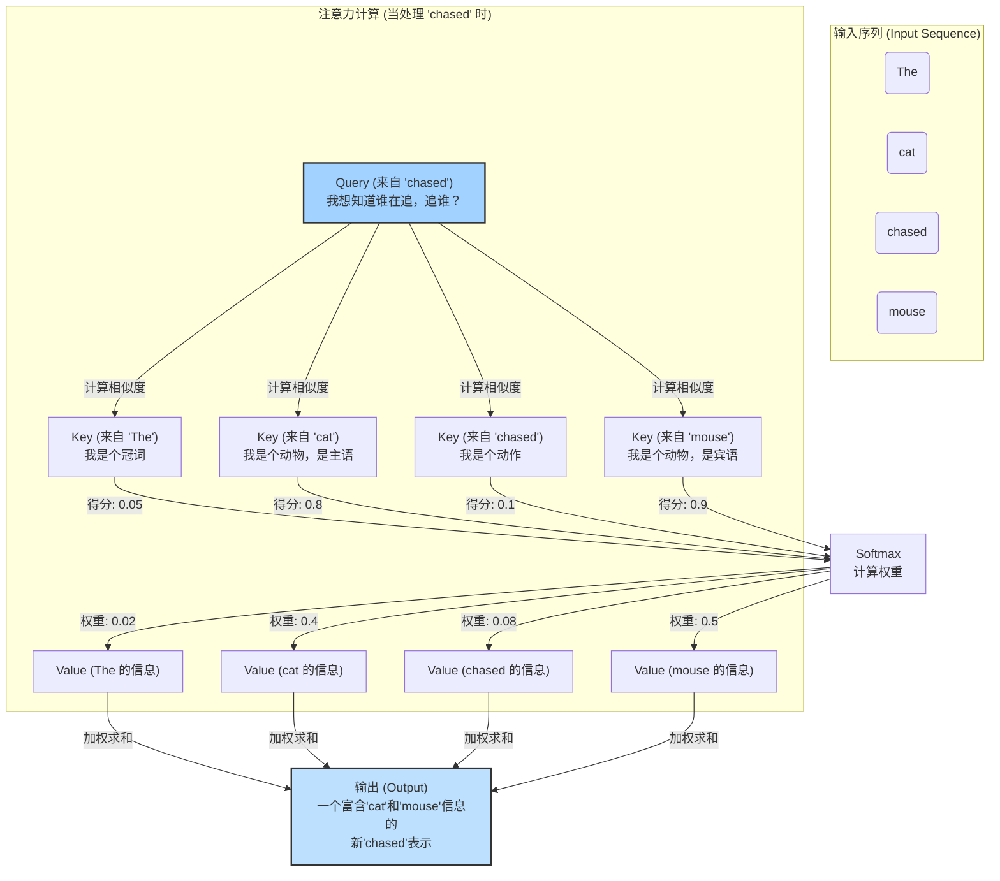

---
{"publish":true,"title":"How does the attention mechanism function in transformer models","tags":["ZK/PN"],"cssclasses":""}
---

## 概念定义

**注意力机制**允许 LLM 在生成或解释文本时，权衡序列中[[🪄AI漫谈/注意力权重怎么来的\|不同词元的重要性]]。它通过计算[[🪄AI漫谈/查询（query）、键（key）和值（value）]]向量之间的相似度得分（例如使用[[🪄AI漫谈/点积（Dot Product）在自注意力机制中是如何起作用的？\|点积运算]]），来聚焦于相关的词元。例如，在句子“The cat chased the mouse”（猫追老鼠）中，注意力机制可以帮助模型将“mouse”（老鼠）与“chased”（追）联系起来。这种机制提高了对上下文的理解能力，使得 [[Transformer]] 在自然语言处理（NLP）任务中非常高效。

>[!readaloud]+ 第一性原理剖析：注意力机制的本质
>想象一下，你正在阅读一段很长的文字。当你读到某个词语时，你的大脑并不会平等地看待这段文字中的所有其他词语。相反，你会根据当前正在处理的这个词，有选择地、有侧重地关注与之最相关的几个词，以便更好地理解其含义。
>
>例如，读到句子“那只灰色的**猫**懒洋洋地**趴**在温暖的**壁炉边**的**垫子**上”中的“趴”字时，你的大脑会立刻将注意力高度集中在“猫”上，同时也会关联到“垫子”和“壁炉边”，因为这些词共同构建了“趴”这个动作的场景。而“灰色”或“温暖”这些词，虽然提供了背景信息，但在理解“趴”这个动作本身时，重要性就稍低一些。
>
>这就是“注意力”的本质：一种资源分配机制，它将有限的认知资源（或计算资源）集中在当前任务最关键的信息上。

## 注意力机制如何运作的

- **第一步：匹配（计算注意力得分）** 你拿着你的“查询”（Query - “人工智能经济影响”），去和图书馆里每一本书的“键”（Key - 标签）进行比对。
    
    - 和“科技、经济、21世纪”这个标签一比，发现**相关度很高**（匹配得分高）。
    - 和“历史、艺术、文艺复兴”这个标签一比，发现**相关度很低**（匹配得分低）。 这个比对过程，在模型里通常就是你提到的“**[[🪄AI漫谈/点积（Dot Product）在自注意力机制中是如何起作用的？\|点积运算]]**”。它计算出你的“查询”和每一个“键”之间的相似度得分。
- **第二步：加权（分配注意力权重）** 你根据这个相关度得分，来分配你的“注意力”。你会花90%的精力去看那本关于科技和经济的书，可能只会花0.1%的精力（甚至不看）那本关于文艺复兴的书。这个百分比，就是“**[[🪄AI漫谈/注意力权重怎么来的\|注意力权重]]**”。得分越高的，权重越大。通常会用一个叫做 [[🪄AI漫谈/Softmax 函数在注意力机制中是如何应用的？\|Softmax 的函数]]来将原始的得分转换成总和为1的权重比例。
    
- **第三步：汇总（得到最终结果）** 最后，你根据分配好的注意力权重，去“阅读”那些书的“值”（Value - 实际内容）。你将90%的权重乘以《科技与经济》的内容，加上0.1%的权重乘以《文艺复兴史》的内容…… 最终，你脑海里形成的知识，是一个**加权融合后的信息**。这个信息高度集中了与你查询最相关的内容，同时又没有完全丢弃其他（可能次要的）信息。
    

这个最终得到的加权“值”的总和，就是注意力机制的输出。它是一个全新的信息表示，它告诉模型：“对于你当前正在处理的这个词，综合整个句子的信息来看，这是与它最相关的上下文精华。”

## 360

- [[啥是**稀疏注意力**”（Sparse Attention）]]
- [[我们用了那么大的精力，终于让机器学会： "Attention is all you need."  与此同时，人类却正在失去注意力]]