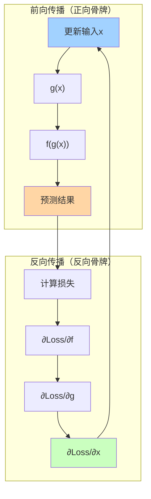

---
{"publish":true,"title":"Chain Rule","created":"2025-07-14T00:21:23.501+08:00","modified":"2025-07-14T00:21:23.502+08:00","tags":["链式法则","Chain Rule","反向传播","梯度下降","LLM","原子概念"],"cssclasses":""}
---


## 🎯 核心概念（一句话总结）
**链式法则是LLM的"多米诺骨牌"传递机制，让错误信号像骨牌一样从输出层一层层传回输入层，告诉每个参数"该怎么调整"。**

## 🎯 生活场景：多米诺骨牌效应

### 🎭 直观理解
想象一排**多米诺骨牌**：
- **推倒最后一块**（输出层错误）
- **力量依次传递**（每层误差传播）
- **第一块知道该往哪倒**（输入层参数调整）

在LLM中：
- **骨牌** = 网络层
- **推倒的力量** = 损失函数
- **传递的方向** = 梯度计算方向

### 🎯 数学公式生活化
```
链式法则：d(f(g(x)))/dx = f'(g(x)) × g'(x)

生活翻译：
"如果A影响B，B影响C，那么A影响C的程度 = A影响B的程度 × B影响C的程度"

例子：
学习效率 → 作业质量 → 考试成绩
学习效率对考试成绩的影响 = 效率对作业的影响 × 作业对成绩的影响
```

## 🎯 LLM中的具体传递机制

### 🔄 反向传播的"骨牌链"

**Transformer结构链**：
```
输入嵌入 → 注意力层 → 前馈层 → 输出层 → 损失计算
              ↑
           链式法则传递方向（反向）
```

**具体传递过程**：
```
1. 输出层：计算预测与真实的差距
   ∂Loss/∂Output = 预测值 - 真实值

2. 前馈层：接收来自输出的误差
   ∂Loss/∂FeedForward = ∂Loss/∂Output × ∂Output/∂FeedForward

3. 注意力层：接收来自前馈的误差
   ∂Loss/∂Attention = ∂Loss/∂FeedForward × ∂FeedForward/∂Attention

4. 嵌入层：接收来自注意力的误差
   ∂Loss/∂Embedding = ∂Loss/∂Attention × ∂Attention/∂Embedding
```

### 📊 可视化理解



## 🎯 三层嵌套函数的传递

### 🧮 复杂链式法则

**Transformer中的三层嵌套**：
```
损失 = f(前馈(g(注意力(h(嵌入)))))

梯度计算：
∂Loss/∂Embedding = ∂Loss/∂前馈 × ∂前馈/∂注意力 × ∂注意力/∂嵌入
```

### 🎯 具体计算示例

**简单数值例子**：
```
假设：
- 嵌入层输出：h(x) = 2x
- 注意力层：g(h) = h²
- 前馈层：f(g) = √g

输入x=3时的前向：
h(3)=6, g(6)=36, f(36)=6

反向传播：
∂f/∂g = 1/(2√36) = 1/12
∂g/∂h = 2h = 12
∂h/∂x = 2

∂f/∂x = (1/12) × 12 × 2 = 2 ✅
```

## 🎯 生活类比：公司决策链

### 🏢 企业决策场景

**决策链条**：
```
员工表现 → 部门业绩 → 公司利润 → CEO决策

链式法则应用：
员工表现对公司决策的影响 = 
员工对部门的影响 × 部门对利润的影响 × 利润对决策的影响
```

### 📈 实际应用

**LLM权重更新**：
```
权重调整量 = 学习率 × 链式法则计算的梯度

具体：
嵌入权重调整 = 0.001 × 2 = 0.002
注意力权重调整 = 0.001 × 12 = 0.012
前馈权重调整 = 0.001 × 1/12 ≈ 0.000083
```

## 🎯 四种链式法则应用场景

| 场景 | 链式结构 | 梯度传递 | 生活比喻 |
|---|---|---|---|
| **单层网络** | f(g(x)) | 二层传递 | 朋友→朋友→结果 |
| **多层感知机** | fₙ(...f₂(f₁(x))) | n层传递 | 多米诺骨牌 |
| **注意力机制** | softmax(QKᵀ)V | 矩阵链式 | 团队决策链 |
| **残差连接** | f(x)+x | 跳跃传递 | 抄近路的导航 |

## 🎯 梯度消失与链式法则

### ⚠️ 问题场景

**梯度消失**：
```
当链式法则中的某个导数接近0时：
∂f/∂x = 接近0 × 接近0 × ... = 接近0
```

**解决方案**：
- **残差连接**：添加跳跃连接保持梯度
- **层归一化**：稳定每层的梯度大小
- **激活函数**：使用ReLU避免梯度消失

### 🎯 数值稳定性技巧

**梯度裁剪**：
```
如果梯度太大：clip(gradient, -1, 1)
如果梯度太小：乘以缩放因子
```

## 🔗 知识网络连接

### 🔍 前置原子概念
- [[🪄AI漫谈/雅可比矩阵（Jacobian Matrix）在 Transformer 的反向传播中扮演什么角色？]] —— 多维梯度计算
- [[🪄AI漫谈/Transformer 如何解决梯度消失（Vanishing Gradient）问题？]] —— 梯度稳定性
- [[🪄AI漫谈/什么是嵌入（Embeddings），它们在 LLM 中是如何初始化的？]] —— 参数初始化

### 🎯 延伸原子概念
- [[Adam优化器如何利用链式法则？]] —— 优化算法应用
- [[梯度爆炸在Transformer中如何处理？]] —— 梯度控制
- [[自动微分（Automatic Differentiation）如何简化链式法则？]] —— 工程实现

## 💡 记忆口诀

**"链式法则三步骤"**：
- **分步骤**：将复杂函数分解为简单步骤
- **逐层算**：每层计算局部导数
- **连起来**：用乘法连接所有局部导数

## 🎯 30秒速记卡片

```
🎴 原子概念：链式法则
├─ 作用：误差反向传播
├─ 机制：逐层传递梯度
├─ 公式：∂f/∂x = ∂f/∂g × ∂g/∂x
└─ 比喻：多米诺骨牌效应
```

## 🧪 验证理解（3个小测试）

1. **选择题**：链式法则主要用于？
   A) 前向传播  B) 反向传播  C) 数据预处理  ✅**B**

2. **判断题**：链式法则可以处理任意多层嵌套函数 ✅**正确**

3. **应用题**：用链式法则计算f(g(h(x)))的导数，其中h(x)=x², g(h)=h+1, f(g)=2g
   ✅**答案示例**：∂f/∂x = 2 × 1 × 2x = 4x

## 🔍 深度思考

> **本质洞察**：链式法则是深度学习的"神经系统"——它让信息能够从输出端"感知"到输入端的每个细微变化，实现真正的"端到端"学习。

---

*返回知识原子库：[[🪄AI漫谈/index\|AI概念地图]]*

---

**原子笔记特性验证**：
- ✅ 单一概念：专注于链式法则在梯度下降中的作用
- ✅ 可独立理解：无需微积分背景知识
- ✅ 可连接：与反向传播、优化算法等关联
- ✅ 可应用：提供具体计算和生活例子