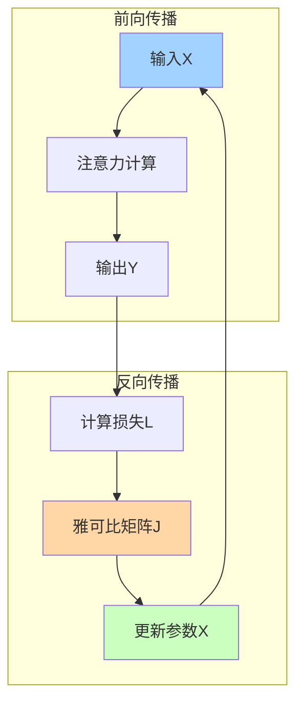

---
{"publish":true,"title":"Jacobian Matrix","created":"2025-07-13T23:48:23.639+08:00","modified":"2025-07-13T23:51:01.403+08:00","tags":["雅可比矩阵","Jacobian","反向传播","梯度计算","Transformer","原子概念"],"cssclasses":""}
---


## 🎯 核心概念（一句话总结）
**雅可比矩阵是Transformer的"导航地图"，告诉每个权重参数"应该往哪个方向调整一点点"才能让模型更准确。**

## 🗺️ 什么是雅可比矩阵？生活化理解

### 🧭 导航比喻
想象你在**迷宫**中寻找出口：
- **传统方法**：盲目乱走，撞墙回头
- **雅可比方法**：有一张地图告诉你"向东3步，向北1步"能更接近出口

在Transformer中：
- **迷宫** = 优化空间（数百万个参数）
- **地图** = 雅可比矩阵（每个参数的调整方向）
- **出口** = 最小损失值

### 📈 梯度下降可视化
```
传统梯度：一条直线调整
雅可比矩阵：多维空间导航

损失函数地形图：
高维度山峰 → 雅可比矩阵 → 找到下山最快路径
```

## 🎯 Transformer中的具体应用

### 🧮 注意力机制的梯度计算

**问题场景**：
当注意力权重更新时，如何知道每个权重应该调整多少？

**雅可比矩阵解决**：
```
输入：Query, Key, Value矩阵
输出：注意力权重梯度

雅可比矩阵维度：
[注意力输出维度] × [输入维度]
= [batch_size, seq_len, d_model] × [batch_size, seq_len, d_model]
```

### 🔄 具体计算过程

**步骤1：前向传播**
```
输入：X → 注意力计算 → 输出：Y
```

**步骤2：反向传播**
```
损失：L = f(Y)
雅可比矩阵：J = ∂L/∂X
调整：X_new = X - learning_rate × J
```

**可视化理解**：


## 🎯 雅可比矩阵的"超能力"

### 🔍 多维梯度导航
传统梯度下降 vs 雅可比矩阵：

| 维度 | 传统梯度 | 雅可比矩阵 |
|---|---|---|
| **单变量** | dy/dx | ∂y/∂x |
| **多变量** | 无法处理 | ∂y₁/∂x₁, ∂y₁/∂x₂... |
| **Transformer** | 不适用 | 百万参数同时优化 |

### 📊 实际应用场景

**1. 注意力权重更新**
```
场景：softmax输出概率分布
雅可比作用：计算每个权重对最终输出的敏感度
结果：精准调整注意力焦点
```

**2. 嵌入向量优化**
```
场景：词嵌入维度调整
雅可比作用：找到每个维度的最佳调整方向
结果：语义空间更精确
```

## 🎯 生活类比：GPS导航系统

### 🚗 驾驶比喻
- **目的地**：最小损失值
- **当前位置**：当前参数值
- **雅可比矩阵**：GPS提供的转弯指示
- **学习率**：车速控制

### 📱 具体场景
```
Transformer训练：
当前损失：2.5
雅可比矩阵：[-0.1, 0.3, -0.05, ...]
调整建议：第1个参数减少0.1，第2个增加0.3...
新损失：2.1 ✅ 更接近目标
```

## 🎯 数学简化版

### 🧮 核心公式
```
雅可比矩阵 J = [∂f_i/∂x_j]
其中：
- f_i = 第i个输出
- x_j = 第j个输入参数
- ∂ = 偏导数符号
```

### 🔢 计算示例
```
简单2D例子：
函数：f(x,y) = [x²y, xy²]
雅可比矩阵：
J = [ [2xy, x²],
      [y², 2xy] ]
```

### 🎯 Transformer规模
```
实际Transformer：
- 输入维度：512维嵌入
- 输出维度：512维输出
- 雅可比矩阵：512×512 = 262,144个偏导数！
```

## 🔗 知识网络连接

### 🔍 前置原子概念
- [[🪄AI漫谈/链式法则（Chain Rule）如何应用于 LLM 的梯度下降？]] —— 梯度计算的基础
- [[🪄AI漫谈/在 LLM 中，嵌入的梯度（Gradients）是如何计算的？]] —— 具体梯度计算方法
- [[🪄AI漫谈/Transformer 如何解决梯度消失（Vanishing Gradient）问题？]] —— 优化背景

### 🎯 延伸原子概念
- [[什么是海森矩阵（Hessian Matrix），它在优化中的作用是什么？]] —— 二阶优化方法
- [[Adam优化器如何利用雅可比矩阵？]] —— 具体优化算法应用
- [[梯度爆炸在Transformer中如何处理？]] —— 梯度稳定性

## 💡 记忆口诀

**"雅可比矩阵三要素"**：
- **多维度**：同时处理多个参数
- **方向感**：每个参数的调整方向
- **敏感度**：参数变化对结果的影响程度

## 🎯 30秒速记卡片

```
🎴 原子概念：雅可比矩阵
├─ 作用：导航地图
├─ 维度：输入×输出
├─ 应用：梯度下降导航
└─ 比喻：GPS转弯指示
```

## 🧪 验证理解（3个小测试）

1. **选择题**：雅可比矩阵的主要作用是？
   A) 增加模型复杂度  B) 梯度导航  C) 数据预处理  ✅**B**

2. **判断题**：Transformer的雅可比矩阵通常有数百万个元素 ✅**正确**

3. **应用题**：用生活例子解释雅可比矩阵
   ✅**答案示例**：就像GPS告诉你"左转会更快到达"，雅可比告诉每个参数"增加0.1会更接近目标"

## 🔍 深度思考

> **本质洞察**：雅可比矩阵是Transformer的"感知系统"——它让模型能够"感知"参数空间的"地形"，从而选择最优的"下山路径"。

---

*返回知识原子库：[[🪄AI漫谈/index\|AI概念地图]]*

---

**原子笔记特性验证**：
- ✅ 单一概念：专注于雅可比矩阵在Transformer中的作用
- ✅ 可独立理解：无需深度学习完整背景
- ✅ 可连接：与梯度计算、优化算法等关联
- ✅ 可应用：提供生活化理解和计算示例